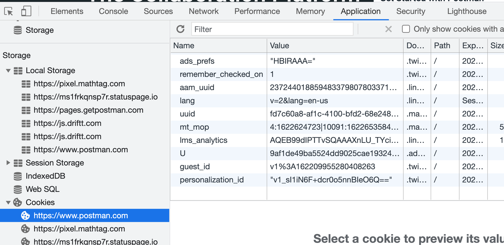

RESTful endpoint:
Representational State Transfer - sever has no idea who you are.
It gets request and sent stuff back.
It can not maintain state - So to get around that, use session data 

cookies session

- Cookies - where does it live? lives browser, the cookie is sent every http request (post/get request).  Server that recognizes the cookie may respond accordingly.  

postaman.com has cookie banner. go to cookie setting.

- we can see what information endpoints we are hitting which is exposed to the internet outside of world. network traffic, therefore sending data (password) to the internet is not secure way to login (using req.query `?password=funny`)

- because of session cookie => server can remember who you are.

- Targeting cookies: all cookies 
    - few things about cookies: 1. cookies have expration date.
- To see cookies:
- console > Storage > Cookies > Application tab


- To clear cookies: Application > Storage > “Clear Site Data”
- Cookies are tiny (4 bytes, a string)

- How to set cookies:
document.cookie = "Mycookie=this site is way cool!!dude!!"

then check cookies > Application tap