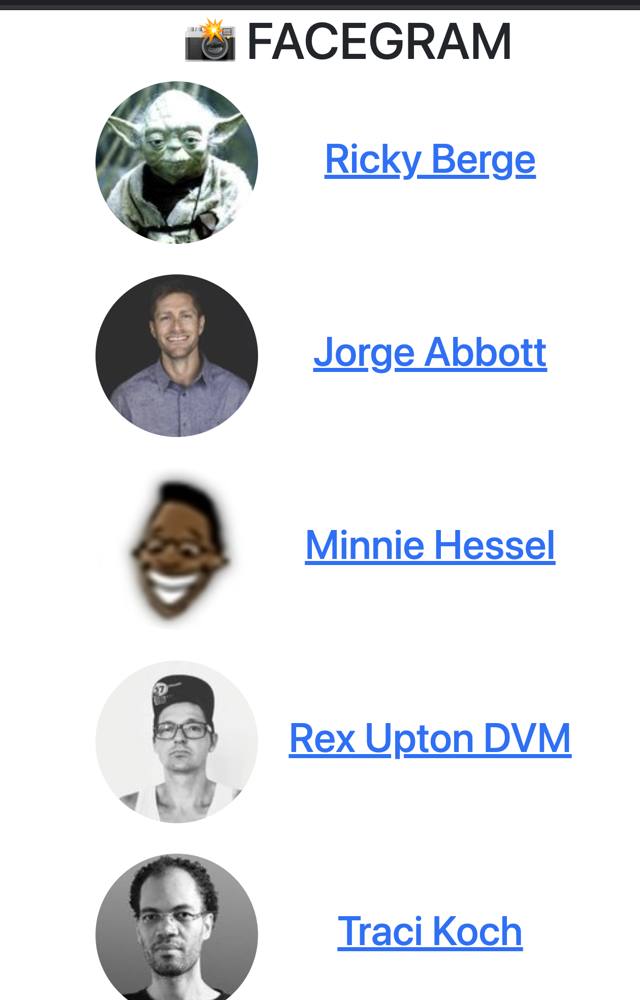

# FaceGram

Your job is to make an address book for your favorite Instagram accounts.
- Home page: list of profiles

- Detail page:

1. A detailed view page for each account.
1. A list of all the accounts you follow. (Just avatar, name and link to detail profile)

Use our examples of server-side rendering with templates and route params to achieve the above results. You can use the data in the dataArray module as your mock database.

1. Start with the detailed view page.
1. You should handle errors if the path is wrong
1. Styling is a bonus, focus on structure.

Remind Dan to show you what he would like this to look like :) 

