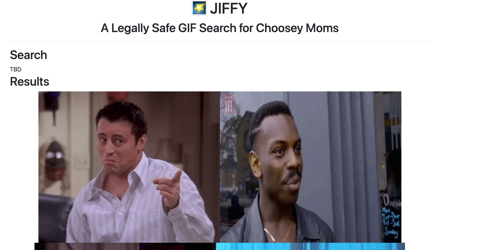

# Exercise: JIFFY (Pt. 1)

## Goal

The goal of this mini-project is to tie together many of the important concepts we have learned in phase 3 of the course:
* React
* Props & State
* Redux
* React-Redux
* Redux Toolkit

In part 1 of this project, you will creating the boilerplate React app, and connecting to the Giphy API. At the end of this part, you should have something that looks like this.
You should have something like this:
 

## Requirements
1. Start with the basic `create-react-template` and modify it to add [React-Redux and the toolkit](https://react-redux.js.org/tutorials/quick-start).
1. Create placeholder react components for your App, the GIF Search Form, and the Image display.
1. Sign up for a [GIHPY developer account](https://developers.giphy.com).
1. Use [RTK Query](https://redux-toolkit.js.org/tutorials/rtk-query) to make an API call to the [Search Endpoint](https://developers.giphy.com/docs/api/endpoint/#search). Use whatever keyword you would like for the search.

**Bonus points**: 
1. Figure out how to distribute your React app using static assets using an Express server.
2. Use Bootstrap of the CSS Framework of your choosing.
3. [Add images directly](https://create-react-app.dev/docs/adding-images-fonts-and-files/) into your React application bundle.
