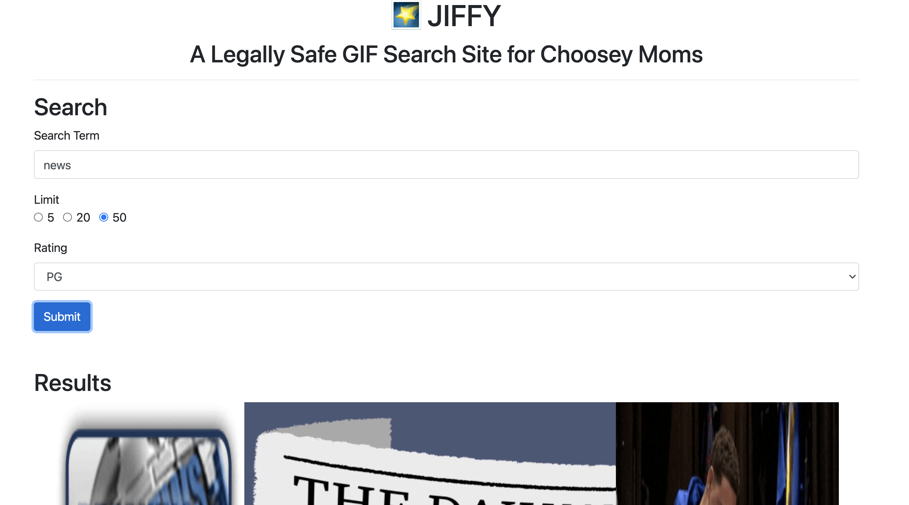

# Exercise: JIFFY (Pt. 2)

## Goal

The goal of this mini-project is to tie together many of the important concepts we have learned in phase 3 of the course:
* React
* Props & State
* Redux
* React-Redux
* Redux Toolkit

In part 2 of this project, you'll be adding a search form to your application that let's you search for GIFs by a number of different filters.

You should have something like this:
 

## Requirements
1. You should use AT LEAST one separate component for the form control.
1. You must use LOCAL STATE to manage the form control data.
1. You must modify REDUX STATE when the user submits the search form. 
Call your data slice "Search".
1. Re-render the images using an updated API call.

**Bonus points**: 
1. Figure out how to distribute your React app using static assets using an Express server.
2. Use Bootstrap of the CSS Framework of your choosing.
3. Make it look pretty.
