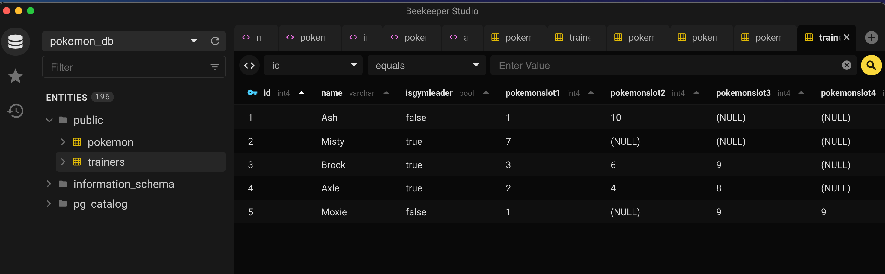

```sql
INSERT INTO track
  (title, rating, len, count, album_id, genre_id)
VALUES
  ('Black Dog', 5, 297, 0, 2, 1),
  ('Stairway', 5, 482, 0, 2, 1),
  ('About to Rock', 5, 313, 0, 1, 2),
  ('Who Made Who', 5, 207, 0, 1, 2)
;
```

## How to create the DB very first time: 
1. I created the script in package.json 

```jason
  "scripts": {
    "db:create": "createdb pokemon_db",
    "db:destroy": "dropdb pokemon_db",
    "db:init": "psql -f schema.sql pokemon_db",
    "db:seed": "psql -f seed.sql pokemon_db",
    "db:reset": "npm run db:destroy; npm run db:create && npm run db:init && npm run db:seed",
    "db:resetnoseed": "npm run db:destroy; npm run db:create && npm run db:init"
  },
```

2. in terminal at the root of pokemon_db
> npm run db:create

yes! You are done creating the database.  Open PostgreSQL (elephant icon) and beekeeper studio (this helps with viewing your data easily!)




3. Seed your database by running this command

> npm run db:seed

4. If you want to reset your database.

> npm run db:reset

5. dump this database for a data backup.

> pg_dump pokemon_db > pokemon.sql

6. To restore from your backup (You’ll see an error when you restore but if you wait until the command finishes you’ll have data’)

> psql -d imdb < titles.sql


