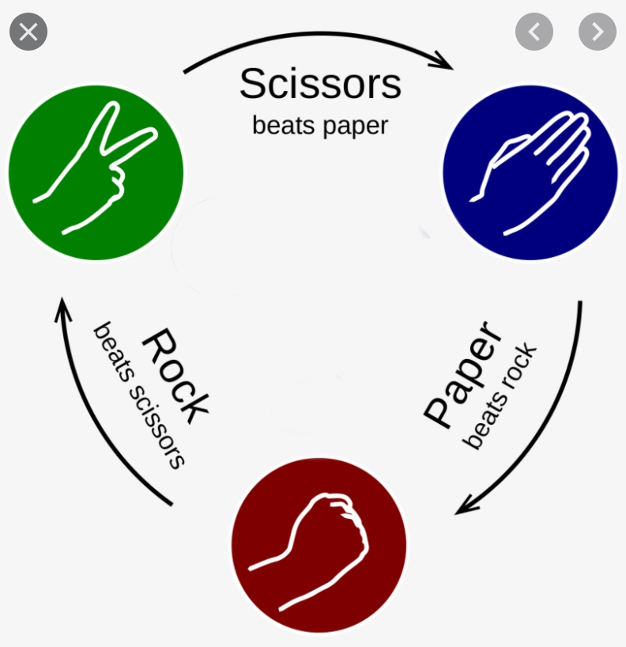

# Implements the game of Rock-Paper-Scissors!

History:
This classic game dates back to the Han Dinesty, over 2200 years ago.
The First International Rock-Paper-Scissors Programming Competition 
was held in 1999 and was won by a team called "Iocaine Powder"

The Game:
Each player choses a move (simultaneously) from the choices:
rock, paper or scissors. 
If they chose the same move the game is a tie. Otherwise:
rock beats scissors
scissors beats paper
paper beats rock.

In this program a human plays against an AI. The AI choses randomly
(we promise). The game is repeated N_GAMES times and the human gets
a total score. Each win is worth +1 points, each loss is worth -1
"""