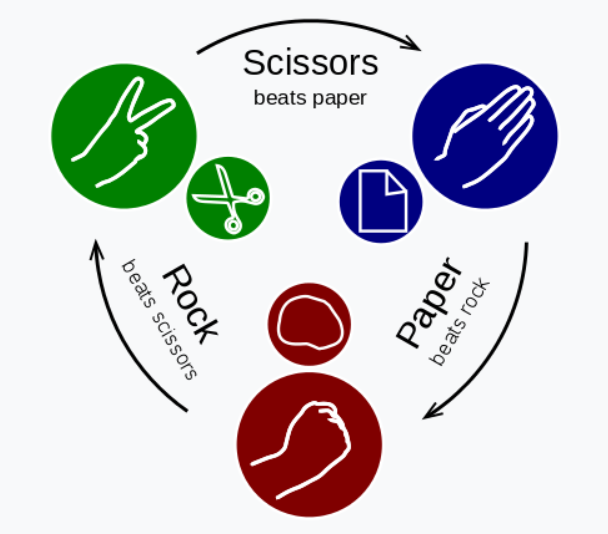
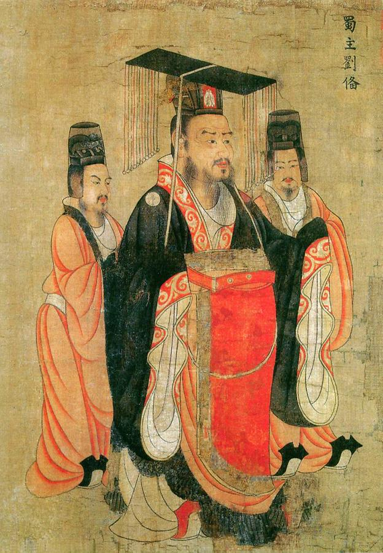

# Implements the game of Rock-Paper-Scissors!

History:

This classic game dates back to the Han Dynesty, over 2200 years ago.
The First International Rock-Paper-Scissors Programming Competition 
was held in 1999 and was won by a team called ["Iocaine Powder"](https://github.com/NavjotMinhas/RockPaperScissors_AI)

The Game:
Each player choses a move (simultaneously) from the choices:
rock, paper or scissors. 
If they chose the same move the game is a tie. Otherwise:
rock beats scissors
scissors beats paper
paper beats rock.

In this program a human plays against an AI. The AI learns from human's move using a scientifically proven winning strategy, a study done by group of Chinese scientist.

The game is repeated N_GAMES times and the human gets
a total score. Each win is worth +1 points, each loss is worth -1

* Here is the best strategy to win at rock-paper-scissors: 

> If you lose the first round, switch to the thing that beats the thing your opponent just played. If you win, don't keep playing the same thing, but instead switch to the thing that would beat the thing that you just played. 
> In other words, play the hand your losing opponent just played. To wit: you win a round with rock against someone else's scissors. They are about to switch to paper. You should switch to scissors. Got it? Good.

[article on rock paper scissors](https://arstechnica.com/science/2014/05/win-at-rock-paper-scissors-by-knowing-thy-opponent/)
